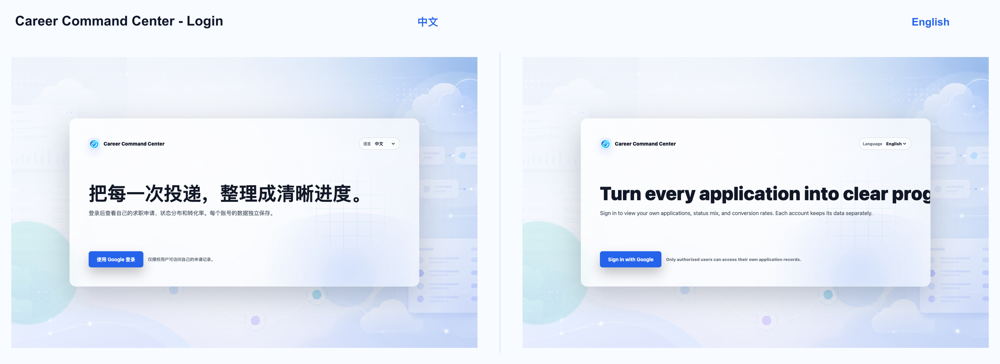
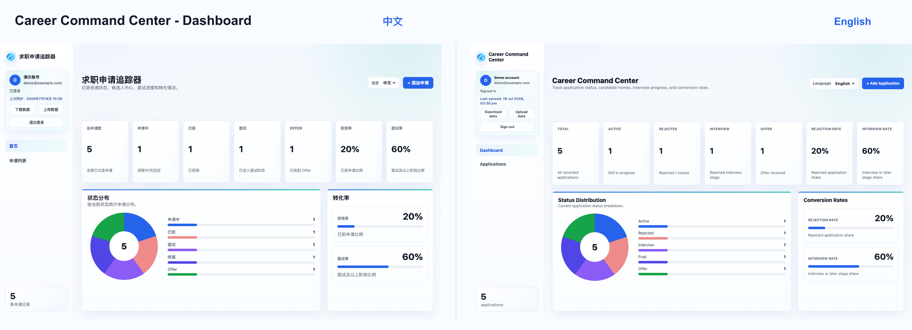
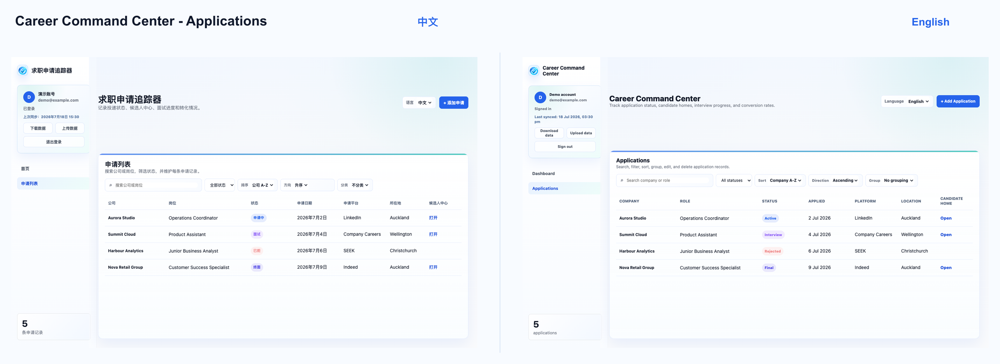

# Career Command Center

A privacy-safe bilingual job application tracker demo for managing applications, stages, candidate portals and job-search progress.

> **Repository type:** Public portfolio demo  
> **Languages:** English and Simplified Chinese  
> **Data:** Fictional sample data only  
> **Authentication:** Simulated Google sign-in  
> **Cloud connection:** Disabled in this public repository  

## Overview

Career Command Center is a bilingual job application management system designed to centralise application records, track application stages and provide a clearer overview of job-search activity.

Job applications are often distributed across LinkedIn, SEEK, company career websites, recruiter emails and separate candidate portals. This can make it difficult to remember:

- which positions have already been applied for;
- when each application was submitted;
- which candidate portal belongs to each application;
- whether a follow-up is required;
- which applications progressed, remained unanswered or were rejected;
- which platforms and role types produced better outcomes.

This public repository preserves the interface, visual design and core interactions of the private production version while replacing real authentication, cloud services and personal records with fictional local data.

No real job application records, candidate portal links, resumes, private email addresses or Supabase credentials are included.

---

## Live Demo

[Open the Career Command Center demo](https://nigaray703-ops.github.io/career-command-demo/)

The Google sign-in button is simulated. It does not contact Google, use OAuth or connect to Supabase.

---

## Key Features

### Bilingual Interface

- English and Simplified Chinese
- Interface language switching
- Bilingual login, dashboard, forms and application records

### Dashboard

- Total application count
- Application-stage statistics
- Progress and rejection indicators
- Application distribution
- Recent job-search activity
- High-level conversion information

### Application Management

Users can:

- add application records;
- edit existing records;
- delete demonstration records;
- record company and position names;
- record location and work arrangement;
- record employment type;
- record application platform;
- save candidate portal links;
- record application dates;
- update application status;
- add rejection reasons and notes.

### Search and Organisation

- Keyword search
- Company and position search
- Status filtering
- Employment-type filtering
- Platform filtering
- Sorting
- Grouping

### Local Data Management

- Download demonstration data as JSON
- Upload compatible JSON backups
- Restore fictional demonstration records
- Modify local data without affecting a private database

### Simulated Authentication

The public demo preserves the login structure of the private production version.

Selecting the Google sign-in button:

- does not contact Google;
- does not use OAuth;
- does not connect to Supabase;
- opens a simulated demonstration account.

---

## Interface Preview

### Login

The login screen provides bilingual controls and simulated access to the demonstration account.



### Dashboard

The dashboard summarises application volume, stages, outcomes and recent activity.



### Applications

The application list supports searching, filtering, sorting, grouping and editing fictional application records.



---

## Public Demo and Private Version

### Public Demo

This repository:

- uses fictional application records;
- uses simulated Google sign-in;
- stores demonstration data locally;
- does not connect to Supabase;
- does not contain real candidate portal links;
- does not contain resumes or private documents;
- is intended for public portfolio review.

### Private Production Version

The private version is maintained separately and may contain:

- real job application records;
- authenticated user access;
- private candidate portal links;
- personal job-search notes;
- cloud synchronisation;
- personal backup data.

The production database, private records and authentication configuration are not included in this repository.

---

## Project Structure

```text
career-command-demo/
├── assets/
│   └── Logos, icons and shared interface assets
├── docs/
│   └── images/
│       └── README screenshots
├── src/
│   ├── jobTrackerApp.js
│   ├── jobTrackerCloud.js
│   ├── jobTrackerLogic.js
│   └── jobTrackerStyles.css
├── .gitignore
├── index.html
└── README.md
```

### Main Files

| File | Purpose |
|---|---|
| `index.html` | Public demo entry point containing the login cover and main application structure |
| `src/jobTrackerApp.js` | Interface rendering, language switching, forms, modals and user interactions |
| `src/jobTrackerCloud.js` | Simulated authentication and fictional local data |
| `src/jobTrackerLogic.js` | Statistics, filtering, sorting, grouping and record-management logic |
| `src/jobTrackerStyles.css` | Responsive styling for the login screen, dashboard, forms and application records |
| `assets/` | Shared logos, icons and visual assets |
| `docs/images/` | Screenshots displayed in this README |

---

## Architecture

The project separates reusable application logic from environment-specific data services.

```text
User Interface
      │
      ▼
jobTrackerApp.js
      │
      ├── jobTrackerLogic.js
      │     ├── statistics
      │     ├── filtering
      │     ├── sorting
      │     ├── grouping
      │     └── record management
      │
      └── jobTrackerCloud.js
            ├── simulated authentication
            ├── fictional local data
            └── JSON import and export
```

This separation allows the public demo to remain aligned with the private production application without exposing:

- personal job-search information;
- private authentication settings;
- database credentials;
- cloud configuration;
- sensitive candidate portal links.

---

## Technology

- HTML5
- CSS3
- JavaScript
- Responsive web design
- Browser-based local data
- JSON import and export
- Bilingual interface logic
- Modular application scripts
- GitHub Pages

The public demo does not require Supabase, Google OAuth, a backend server, a database account or private environment variables.

---

## Running Locally

Clone the repository:

```bash
git clone https://github.com/nigaray703-ops/career-command-demo.git
cd career-command-demo
```

Start a local server:

```bash
python3 -m http.server 8000
```

Open:

```text
http://localhost:8000
```

---

## Demo Usage

1. Open the application.
2. Select English or Chinese.
3. Click the Google sign-in button.
4. Enter the simulated demonstration account.
5. Review the dashboard statistics.
6. Search, filter or group application records.
7. Add, edit or delete fictional records.
8. Download the demonstration data as JSON.
9. Upload a compatible demonstration backup when required.

The simulated sign-in process does not access any real Google account.

---

## Privacy and Security

This repository is designed as a privacy-safe portfolio demonstration.

It does not intentionally include:

- real job application records;
- real candidate portal URLs;
- personal email account data;
- resumes or cover letters;
- recruiter communications;
- Supabase credentials;
- Google OAuth credentials;
- production environment variables;
- private API keys;
- production database exports.

### Do Not Commit

```text
.env
.env.local
Supabase service keys
Google OAuth secrets
real application backups
personal resumes
candidate portal credentials
private email addresses
production database exports
```

Before publishing changes, review:

- Git status
- Committed files
- `.gitignore`
- Screenshots
- JSON demonstration data
- Browser storage
- Repository history

Removing a sensitive file from the latest commit may not remove it from Git history. Exposed credentials should be revoked and replaced.

---

## Data Disclaimer

All companies, positions, dates, statuses, links and notes shown in the public demo are fictional demonstration content.

This project is not affiliated with Google, LinkedIn, SEEK, Supabase or any employer represented in the fictional demonstration data.

---

## Project Status

**Public demo status: Functional and available for portfolio review.**

The current version includes:

- bilingual login and application interfaces;
- simulated authentication;
- dashboard statistics;
- searchable application records;
- filtering, sorting and grouping;
- record creation, editing and deletion;
- JSON import and export;
- responsive desktop and mobile layouts;
- fictional demonstration data.

The private production version continues to be maintained separately.

---

## Planned Improvements

- Stronger JSON import validation
- Clearer import error reporting
- More detailed interview-stage tracking
- Improved mobile application cards
- Expanded conversion metrics
- Keyboard-navigation improvements
- Accessibility review
- Automated tests for core application logic

These are planned directions and may not yet be implemented.

---

## Skills Demonstrated

- Business process analysis
- Workflow design
- Requirements translation
- Interface prototyping
- Bilingual product design
- JavaScript application logic
- Responsive web design
- Local data management
- JSON import and export
- Privacy-conscious product design
- Public and private environment separation
- Iterative interface improvement
- Git and GitHub version control

---

## 中文说明

Career Command Center 是一个中英文求职申请追踪器，用于集中管理求职申请记录、申请阶段、候选人中心链接和求职进度。

### 主要功能

- 中英文界面切换
- 模拟 Google 登录
- 首页数据仪表盘
- 公司和岗位搜索
- 申请状态筛选
- 排序和分组
- 添加、编辑和删除演示记录
- JSON 数据下载与上传
- 桌面端和移动端响应式布局

### 公开演示版

这个仓库是公开的 GitHub 演示版。演示版保留了私人正式版的主要界面结构、视觉样式和核心交互，但只使用虚构示例数据。

本仓库不包含：

- 真实求职记录
- 真实候选人中心链接
- 个人简历或求职信
- 招聘邮件
- Supabase 登录配置
- Google OAuth 配置
- 私人数据库
- 真实云端备份

请不要向这个公开仓库提交真实个人数据、密钥、`.env` 文件或私人 JSON 备份。

---

## Licence

No licence has currently been specified.

Without an explicit `LICENSE` file, the source code remains protected under default copyright rules and should not be assumed to be available for unrestricted reuse, redistribution or commercial use.
